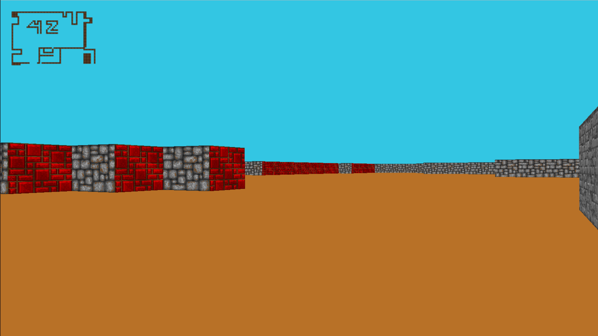
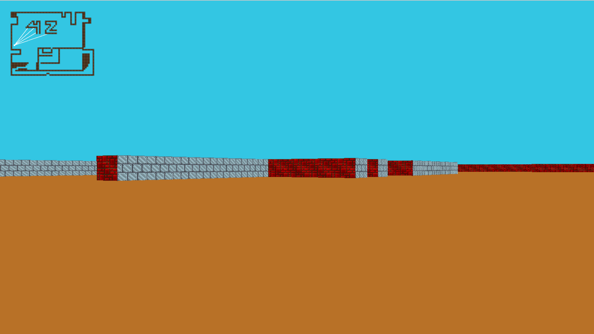

# 🎮 Proyecto cub3d - 42 Network


## 📖 Descripción
🕹️ **cub3d** es un proyecto de renderizado 3D inspirado en el clásico juego Wolfenstein 3D. Este proyecto se centra en los fundamentos de los gráficos por computadora y ofrece una oportunidad única para explorar la técnica de ray-casting en un entorno de juego.

## ✨ Características
- 🌌 Renderizado 3D utilizando la técnica de ray-casting.
- 🏃‍♂️ Control de jugador para exploración del mapa.
- 🎨 Soporte para diferentes texturas y efectos de iluminación.
- 🖥️ Uso de la minilibx, una biblioteca gráfica proporcionada por 42 Network.

## 🚀 Instalación
Para instalar y ejecutar **cub3d** en tu sistema local, sigue estos pasos:

```bash
git clone [url-de-tu-repositorio]
cd cub3d
make

## 🕹️ Uso
Para iniciar el juego, ejecuta:

```bash
./cub3d [ruta/a/tu/mapa.cub]

### Controles
- W A S D para moverse.
- 🡄🡆 : Flechas del teclado para rotar la vista.

## 🤝 Contribuciones
Las contribuciones son siempre bienvenidas. Si deseas contribuir, por favor:

1. Haz un fork del proyecto.
2. Crea una rama para tu característica (`git checkout -b feature/AmazingFeature`).
3. Haz commit de tus cambios (`git commit -m 'Add some AmazingFeature'`).
4. Haz push a la rama (`git push origin feature/AmazingFeature`).
5. Abre un Pull Request.

## 👥 Créditos
- [isromero's GitHub](https://github.com/isromero)
- [amsteradri's GitHub](https://github.com/amsteradri)

